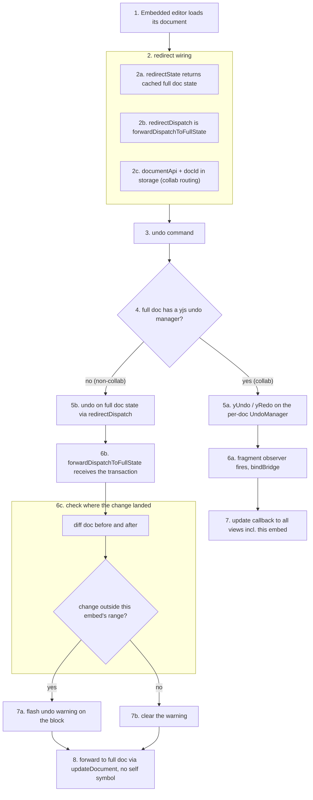
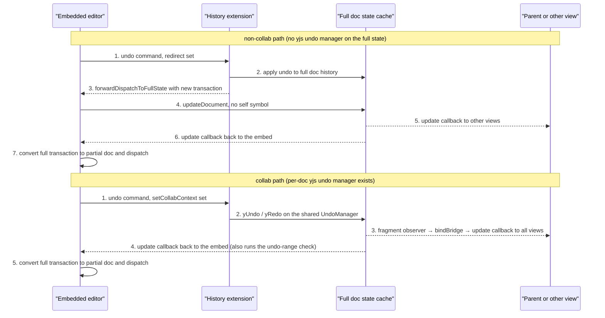

# How history handles embeds

## The problem

An embedded editor is its own `Editor` with its own history stack, but the document it edits lives in the per-document cache. Undo/redo must work across that boundary: pressing undo inside an embed should walk the *full document's* history, not just the partial doc the embed holds. The extension solves this by letting a view **redirect** its undo/redo to another state and dispatch channel.

## What lives where

| History extension (`History.ts`) | Embedded view (`useEmbeddedEditor.ts`) |
|---|---|
| `redirectState` / `redirectDispatch` / `checkUndoRange` in storage, set via the `setHistoryRedirect` command (tiptap v3's `this.options` is a getter returning a fresh copy per access, so post-init state lives in storage) | wires the redirect on load: state = cached full doc, dispatch = `forwardDispatchToFullState` |
| `documentApi` / `docId` in storage, set via the `setCollabContext` command (same pattern as Collaboration's `setCollabBridge`) | calls both commands after load; embedded editors don't go through `preEditorInit`, so they wire this up themselves |
| `undo`/`redo` commands + a filter plugin that drops the command's own transaction | `showUndoWarning` ref, flashed when an undo lands outside the block (checked in `onUpdateDocument` via `isUndoOutsideRange`) |
| plain history behavior when no redirect is set | clears the redirect and listeners on unload |

## The undo flow

On load, the embed calls `setHistoryRedirect` with a getter for the cached full doc state and `forwardDispatchToFullState`. From then on, `undo`/`redo` run against the full doc's history instead of the embed's own. The command tags its transaction so the filter plugin keeps it out of the embed's history stack.

**Collab override:** The redirect is always wired up, but when the full doc has a yjs undo manager (collab active — `yUndoPluginKey.getState(fullState)` holds it), the `undo`/`redo` command bypasses the redirect entirely and calls `yUndo(fullState)` / `yRedo(fullState)` directly on the per-doc shared UndoManager. The undo manager triggers the fragment observer → `bindBridge`, so propagation happens through the normal yjs pipeline (the embed re-renders via its `updateDocument` callback, not a forwarded transaction). The redirect dispatch (`forwardDispatchToFullState`) is only used for non-collab documents.

The forwarded transaction (non-collab path only) is sent without the embed's self symbol, so the embed receives it back through its own `update` callback and re-renders from the full doc. When an undo lands outside the block (e.g. a parent document change), the content is untouched but the block flashes briefly to signal the undo happened elsewhere.

> **Key detail:** Forwarded undo transactions carry `no-step-convert` and `no-schema-convert` metas, so the full-doc state applies them as-is (the full doc is already their base). The embed's own edits still go through the normal step conversion for partial docs.

## Receiving updates from the full doc

The other direction uses `convertFullTransactionForPartialState`: a whole-document embed re-creates the steps against its own schema; a block embed replaces the changed range of the embedded node, since mapping individual steps across the boundary is not tractable. If the embed node was deleted in the full doc, the conversion returns nothing and the embed partially unloads its document.

## Cursor restoration (collab)

Embedded editors register the `Collaboration` extension too, so remote yjs transactions that move text above this embed's cursor restore it. The bridge lives on the per-doc full state (created in `createCollaborationPlugins` during load), not on the view, so the extension is registered unconfigured and handed its bridge via the `setCollabBridge` command after load — same storage-based pattern as `setHistoryRedirect`/`setCollabContext`. The restore plugin reads the bridge lazily from storage (prosemirror calls plugin spec callbacks with their own `this`), so it works whether the bridge was set at configure time or via command. Root editors get the same wiring in `postEditorInit`.

## Cleanup

On unload, the embed removes its listeners, calls the api's `unload`, and clears the history redirect (`setHistoryRedirect(undefined, undefined)`). Recursively embedded or too-deep embeds never load their document, so they have nothing to clean up.
